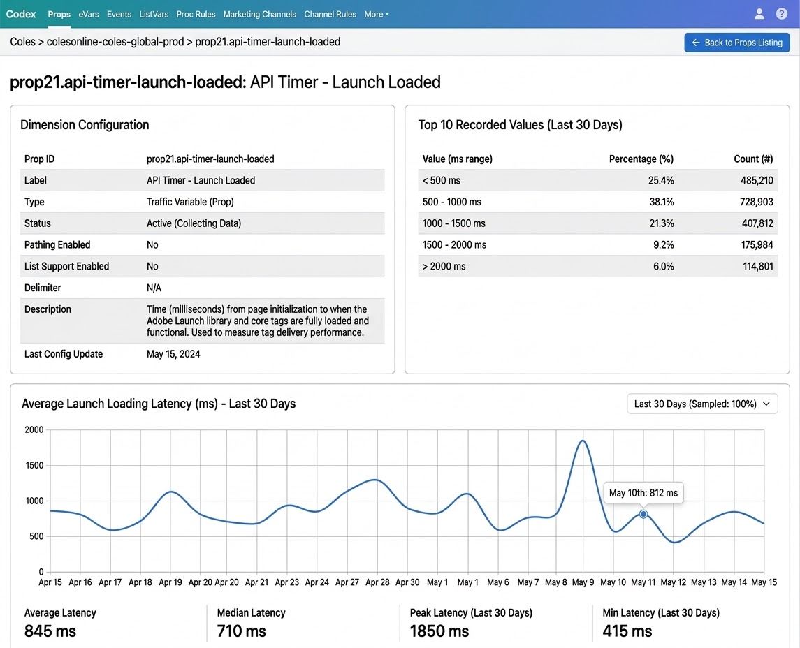

# Dimension Details View Implementation Plan

## Executive Summary

This document provides a comprehensive plan for implementing dimension detail pages in the Codex application. Detail pages allow administrators to click on a data dimension (prop, eVar) from the listing and view its configuration, top recorded values, and usage trends over the last 30 days.

**Goal:**
Enable administrators to verify that data dimensions are collecting data correctly by providing:
- Dimension configuration details
- Top 10 recorded values with counts and percentages
- 30-day trend visualization with summary statistics

**Current State:**
- Listing pages for Props, eVars, Events exist
- No detail/drill-down capability for individual dimensions
- Adobe Analytics API 2.0 service already implemented

**Target State:**
- Clickable dimension IDs in listing tables
- Detail pages at `/props/<prop_id>` and `/evars/<evar_id>`
- Configuration table, top values table, and Chart.js trend visualization
- Summary statistics (average, median, peak, min)

---

## 1. Feature Requirements

### 1.1 User Story

As an Analytics Administrator, I want to click on a prop or eVar from the listing page and see detailed information about its configuration and recent data collection, so I can verify the dimension is working correctly.

### 1.2 Acceptance Criteria

1. **Clickable IDs**: Prop and eVar IDs in listing tables are clickable links
2. **Detail Page Layout**: Two-column layout with configuration (left) and top values (right)
3. **Configuration Table**: Shows dimension ID, label, type, status, and type-specific settings
4. **Top Values Table**: Shows top 10 values with percentage and count for last 30 days
5. **Trend Chart**: Line chart showing daily occurrences/instances over last 30 days
6. **Summary Statistics**: Average, median, peak, and min values displayed below chart
7. **Navigation**: "Back to [Props/eVars] Listing" button and breadcrumb navigation
8. **Caching**: All API data is cached per the existing caching strategy

### 1.3 Metrics

| Dimension Type | Top Values Metric | Trend Metric |
|----------------|-------------------|--------------|
| Props (Traffic Variables) | `occurrences` | `occurrences` |
| eVars (Conversion Variables) | `instances` | `instances` |

### 1.4 Date Range

Fixed 30-day lookback period for both top values and trend data.

---

## 2. UI/UX Design

### 2.1 Page Layout

```
┌─────────────────────────────────────────────────────────────────────────────┐
│ Codex  Props  eVars  Events  ListVars  Proc Rules  Marketing Channels  ...  │
├─────────────────────────────────────────────────────────────────────────────┤
│ Company > rsid > prop1                              [← Back to Props Listing]│
├─────────────────────────────────────────────────────────────────────────────┤
│                                                                             │
│ prop1: Page Name                                                            │
│                                                                             │
│ ┌─────────────────────────────┐  ┌─────────────────────────────────────────┐│
│ │ Dimension Configuration     │  │ Top 10 Recorded Values (Last 30 Days)  ││
│ │                             │  │                                         ││
│ │ Prop ID      prop1          │  │ Value          Percentage    Count      ││
│ │ Label        Page Name      │  │ ─────────────────────────────────────── ││
│ │ Type         Traffic Var    │  │ Homepage       25.4%         485,210    ││
│ │ Status       Active         │  │ Products       18.2%         348,102    ││
│ │ Pathing      No             │  │ Cart           12.1%         231,456    ││
│ │ List Support No             │  │ ...                                     ││
│ │ Delimiter    N/A            │  │                                         ││
│ │ Description  ...            │  │                                         ││
│ └─────────────────────────────┘  └─────────────────────────────────────────┘│
│                                                                             │
│ ┌─────────────────────────────────────────────────────────────────────────┐ │
│ │ Page Name - Last 30 Days                    [Last 30 Days (Sampled: 100%)]│
│ │                                                                         │ │
│ │     ╱╲    ╱╲                                                            │ │
│ │    ╱  ╲  ╱  ╲    ╱╲                                                     │ │
│ │   ╱    ╲╱    ╲  ╱  ╲                                                    │ │
│ │  ╱            ╲╱    ╲___                                                │ │
│ │ ╱                       ╲___╱                                           │ │
│ │                                                                         │ │
│ └─────────────────────────────────────────────────────────────────────────┘ │
│                                                                             │
│ ┌───────────────┐ ┌───────────────┐ ┌───────────────┐ ┌───────────────┐    │
│ │ Average       │ │ Median        │ │ Peak          │ │ Min           │    │
│ │ 845,210       │ │ 710,000       │ │ 1,850,000     │ │ 415,000       │    │
│ └───────────────┘ └───────────────┘ └───────────────┘ └───────────────┘    │
│                                                                             │
├─────────────────────────────────────────────────────────────────────────────┤
│ Report Suite: rsid  Cached: 2026-03-13 10:00  Age: 5 minutes                │
└─────────────────────────────────────────────────────────────────────────────┘
```



### 2.2 Configuration Fields by Dimension Type

#### Props (Traffic Variables)
| Field | Source |
|-------|--------|
| Prop ID | `dimension.id` (stripped of `variables/` prefix) |
| Label | `dimension.name` or `dimension.title` |
| Type | Static: "Traffic Variable (Prop)" |
| Status | `dimension.reportable` → "Active (Collecting Data)" or "Inactive" |
| Pathing Enabled | `dimension.pathable` → "Yes" or "No" |
| List Support Enabled | `dimension.listEnabled` → "Yes" or "No" |
| Delimiter | `dimension.listDelimiter` or "N/A" |
| Description | `dimension.description` or "N/A" |

#### eVars (Conversion Variables)
| Field | Source |
|-------|--------|
| eVar ID | `dimension.id` (stripped of `variables/` prefix) |
| Label | `dimension.name` or `dimension.title` |
| Type | Static: "Conversion Variable (eVar)" |
| Status | `dimension.reportable` → "Active (Collecting Data)" or "Inactive" |
| Allocation | `dimension.allocationModel.name` or "N/A" |
| Expiration | `dimension.expirationType` or "N/A" |
| Description | `dimension.description` or "N/A" |

### 2.3 Styling

- Uses existing Bootstrap 5 card components
- Chart.js for line chart visualization
- Responsive two-column layout (stacks on mobile)
- Consistent with existing Codex design language

---

## 3. API Endpoints Required

### 3.1 Get Single Dimension

**Endpoint:** `GET /{globalCompanyId}/dimensions/{id}`

**Parameters:**
- `id`: Dimension ID (e.g., `variables/prop1`)
- `rsid`: Report suite ID (query param)

**Response:** `AnalyticsDimension` object with configuration details

**Usage:** Fetch dimension metadata for configuration table

### 3.2 Get Top Items

**Endpoint:** `GET /{globalCompanyId}/reports/topItems`

**Parameters:**
- `rsid`: Report suite ID
- `dimension`: Dimension ID (e.g., `variables/prop1`)
- `dateRange`: Format `YYYY-MM-DD/YYYY-MM-DD` (30 days)
- `limit`: Number of items (10)

**Response:** Ranked list of top dimension values with counts

**Usage:** Populate top 10 recorded values table

### 3.3 Run Report (Time Series)

**Endpoint:** `POST /{globalCompanyId}/reports`

**Request Body:**
```json
{
  "rsid": "report-suite-id",
  "globalFilters": [
    {
      "type": "dateRange",
      "dateRange": "2026-02-11T00:00:00/2026-03-13T23:59:59"
    }
  ],
  "metricContainer": {
    "metrics": [
      {"id": "metrics/occurrences"}
    ]
  },
  "dimension": "variables/daterangeday",
  "settings": {
    "dimensionSort": "asc",
    "limit": 31
  }
}
```

**Response:** Daily breakdown of metric values

**Usage:** Generate trend chart data and calculate summary statistics

---

## 4. Code Changes Summary

### 4.1 Files to Create

| File | Purpose |
|------|---------|
| `app/templates/detail.html` | Detail page template with config table, top values, chart |

### 4.2 Files to Modify

| File | Changes |
|------|---------|
| `app/services/adobe_analytics_v2.py` | Add `get_dimension()`, `get_top_items()`, `get_dimension_trend()` methods |
| `app/routes/main.py` | Add `/props/<prop_id>` and `/evars/<evar_id>` routes |
| `app/templates/table.html` | Make Prop/eVar ID columns clickable links |
| `app/templates/base.html` | Add `dimension_id` to breadcrumb |

### 4.3 Dependencies

| Dependency | Purpose | Installation |
|------------|---------|--------------|
| Chart.js 4.x | Trend line visualization | CDN (no pip install needed) |

---

## 5. Service Layer Implementation

### 5.1 New Methods for AdobeAnalyticsV2Service

#### get_dimension(rsid, dimension_id)

```python
def get_dimension(self, rsid: str, dimension_id: str) -> dict:
    """
    Get details for a single dimension
    
    Args:
        rsid: Report suite ID
        dimension_id: Dimension ID (e.g., 'variables/prop1')
    
    Returns:
        Dimension configuration details
    """
    result = self._make_request(
        f"dimensions/{dimension_id}",
        params={"rsid": rsid}
    )
    return result if isinstance(result, dict) else {}
```

#### get_top_items(rsid, dimension, metric, limit, days)

```python
def get_top_items(
    self,
    rsid: str,
    dimension: str,
    metric: str = "occurrences",
    limit: int = 10,
    days: int = 30
) -> list[dict]:
    """
    Get top items for a dimension
    
    Args:
        rsid: Report suite ID
        dimension: Dimension ID (e.g., 'variables/prop1')
        metric: Metric to rank by ('occurrences' or 'instances')
        limit: Number of items to return
        days: Number of days to look back
    
    Returns:
        List of top items with value, count, and percentage
    """
    end_date = datetime.now()
    start_date = end_date - timedelta(days=days)
    date_range = f"{start_date.strftime('%Y-%m-%d')}/{end_date.strftime('%Y-%m-%d')}"
    
    result = self._make_request(
        "reports/topItems",
        params={
            "rsid": rsid,
            "dimension": dimension,
            "limit": limit,
            "dateRange": date_range
        }
    )
    
    # Transform response to simpler format with percentages
    items = []
    rows = result.get("rows", [])
    total = sum(row.get("data", [0])[0] for row in rows if row.get("data"))
    
    for row in rows:
        value = row.get("value", "")
        count = row.get("data", [0])[0] if row.get("data") else 0
        percentage = (count / total * 100) if total > 0 else 0
        items.append({
            "value": value,
            "count": count,
            "percentage": round(percentage, 1)
        })
    
    return items
```

#### get_dimension_trend(rsid, dimension, metric, days)

```python
def get_dimension_trend(
    self,
    rsid: str,
    dimension: str,
    metric: str = "occurrences",
    days: int = 30
) -> dict:
    """
    Get daily trend data for a dimension (total occurrences per day)
    
    Args:
        rsid: Report suite ID
        dimension: Dimension ID (e.g., 'variables/prop1')
        metric: Metric to use ('occurrences' or 'instances')
        days: Number of days to look back
    
    Returns:
        Dict with 'dates', 'values', and 'stats' (avg, median, max, min)
    """
    end_date = datetime.now()
    start_date = end_date - timedelta(days=days)
    
    request_body = {
        "rsid": rsid,
        "globalFilters": [
            {
                "type": "dateRange",
                "dateRange": f"{start_date.strftime('%Y-%m-%dT00:00:00')}/{end_date.strftime('%Y-%m-%dT23:59:59')}"
            }
        ],
        "metricContainer": {
            "metrics": [{"id": f"metrics/{metric}"}]
        },
        "dimension": "variables/daterangeday",
        "settings": {
            "dimensionSort": "asc",
            "limit": days + 1
        }
    }
    
    result = self._make_request("reports", method="POST", json_data=request_body)
    
    dates = []
    values = []
    
    for row in result.get("rows", []):
        dates.append(row.get("value", ""))
        row_data = row.get("data", [0])
        values.append(row_data[0] if row_data else 0)
    
    # Calculate statistics
    stats = {}
    if values:
        numeric_values = [v for v in values if isinstance(v, (int, float))]
        if numeric_values:
            stats = {
                "avg": round(sum(numeric_values) / len(numeric_values), 1),
                "median": round(sorted(numeric_values)[len(numeric_values) // 2], 1),
                "max": max(numeric_values),
                "min": min(numeric_values)
            }
    
    return {"dates": dates, "values": values, "stats": stats}
```

---

## 6. Route Implementation

### 6.1 Props Detail Route

```python
@main_bp.route('/props/<prop_id>')
def prop_detail(prop_id: str):
    """Display detail page for a specific prop"""
    api = get_api_service()
    rsid = get_rsid()
    
    # Normalize prop_id to API format
    dimension_id = f"variables/{prop_id}" if not prop_id.startswith("variables/") else prop_id
    display_id = prop_id.replace("variables/", "")
    
    # Get dimension configuration (cached)
    dimension = get_cached_data(
        f'prop_detail_{display_id}',
        lambda: api.get_dimension(rsid, dimension_id)
    )
    
    # Get top 10 values using occurrences (cached)
    top_items = get_cached_data(
        f'prop_top_{display_id}',
        lambda: api.get_top_items(rsid, dimension_id, metric="occurrences", limit=10, days=30)
    )
    
    # Get trend data (cached)
    trend_data = get_cached_data(
        f'prop_trend_{display_id}',
        lambda: api.get_dimension_trend(rsid, dimension_id, metric="occurrences", days=30)
    )
    
    return render_template(
        'detail.html',
        title=f'{display_id}: {dimension.get("name", "")}',
        app_title=current_app.config['APP_TITLE'],
        dimension=dimension,
        dimension_id=display_id,
        dimension_type='prop',
        dimension_type_label='Traffic Variable (Prop)',
        top_items=top_items,
        trend_data=trend_data,
        rsid=rsid,
        cache_info=get_cache_info(),
        active_tab='props',
        back_url='/props',
        back_label='Back to Props Listing'
    )
```

### 6.2 eVars Detail Route

```python
@main_bp.route('/evars/<evar_id>')
def evar_detail(evar_id: str):
    """Display detail page for a specific eVar"""
    api = get_api_service()
    rsid = get_rsid()
    
    # Normalize evar_id to API format
    dimension_id = f"variables/{evar_id}" if not evar_id.startswith("variables/") else evar_id
    display_id = evar_id.replace("variables/", "")
    
    # Get dimension configuration (cached)
    dimension = get_cached_data(
        f'evar_detail_{display_id}',
        lambda: api.get_dimension(rsid, dimension_id)
    )
    
    # Get top 10 values using instances (cached)
    top_items = get_cached_data(
        f'evar_top_{display_id}',
        lambda: api.get_top_items(rsid, dimension_id, metric="instances", limit=10, days=30)
    )
    
    # Get trend data (cached)
    trend_data = get_cached_data(
        f'evar_trend_{display_id}',
        lambda: api.get_dimension_trend(rsid, dimension_id, metric="instances", days=30)
    )
    
    return render_template(
        'detail.html',
        title=f'{display_id}: {dimension.get("name", "")}',
        app_title=current_app.config['APP_TITLE'],
        dimension=dimension,
        dimension_id=display_id,
        dimension_type='evar',
        dimension_type_label='Conversion Variable (eVar)',
        top_items=top_items,
        trend_data=trend_data,
        rsid=rsid,
        cache_info=get_cache_info(),
        active_tab='evars',
        back_url='/evars',
        back_label='Back to eVars Listing'
    )
```

---

## 7. Template Implementation

### 7.1 detail.html Template

See full template in implementation section. Key components:

1. **Header Section**
   - Title with dimension ID and name
   - "Back to Listing" button

2. **Two-Column Layout**
   - Left: Configuration table in Bootstrap card
   - Right: Top 10 values table in Bootstrap card

3. **Chart Section**
   - Full-width Bootstrap card
   - Chart.js line chart with trend data
   - Date range badge

4. **Statistics Row**
   - Four equal-width cards showing Average, Median, Peak, Min

### 7.2 table.html Modifications

Add conditional links for Prop and eVar columns:

```html

    <a href="/props/{{ row[col] }}">{{ row[col] }}</a>

    <a href="/evars/{{ row[col] }}">{{ row[col] }}</a>

    {{ row[col] if row[col] is not none else '' }}

```

### 7.3 base.html Modifications

Update breadcrumb to include dimension ID when present:

```html
<h5 class="mb-0">
    {{ app_title }} > {{ rsid }} > {{ dimension_id }}
</h5>
```

---

## 8. Caching Strategy

### 8.1 Cache Keys

| Data Type | Cache Key Pattern | TTL |
|-----------|-------------------|-----|
| Dimension config | `prop_detail_{id}` / `evar_detail_{id}` | 1 hour (default) |
| Top items | `prop_top_{id}` / `evar_top_{id}` | 1 hour (default) |
| Trend data | `prop_trend_{id}` / `evar_trend_{id}` | 1 hour (default) |

### 8.2 Cache Behavior

- Uses existing `CacheService` from `app/services/cache.py`
- Per-report-suite caching (keyed by rsid)
- Hourly expiration matches existing cache strategy
- Cache clear via `/cache/clear` route clears all dimension detail caches

---

## 9. Error Handling

### 9.1 API Errors

| Error | User Experience |
|-------|-----------------|
| Dimension not found (404) | Show "Dimension not found" message with back link |
| No data available | Show "No data available for the last 30 days" in each section |
| API rate limit (429) | Retry with exponential backoff (handled in service layer) |
| Authentication error (401) | Redirect to error page with auth instructions |

### 9.2 Graceful Degradation

- If top items API fails, show configuration only
- If trend API fails, show configuration and top items only
- If dimension API fails, show error message with back navigation

---

## 10. Testing Strategy

### 10.1 Manual Testing Checklist

- [ ] Props listing: IDs are clickable links
- [ ] eVars listing: IDs are clickable links
- [ ] Prop detail page loads without errors
- [ ] eVar detail page loads without errors
- [ ] Configuration table shows correct data
- [ ] Top 10 values table shows data with percentages
- [ ] Trend chart renders correctly
- [ ] Summary statistics are calculated correctly
- [ ] Back button navigates to correct listing
- [ ] Breadcrumb shows correct path
- [ ] Cache works for detail page data
- [ ] Page handles missing/empty data gracefully

### 10.2 Test Scenarios

1. **Prop with data**: Click on active prop → All sections populate
2. **eVar with data**: Click on active eVar → All sections populate
3. **Prop without recent data**: Click on inactive prop → Shows "No data available"
4. **Invalid dimension**: Navigate to `/props/prop999` → Shows error message
5. **Cache behavior**: Load page twice → Second load is faster (cached)

---

## 11. Future Enhancements

### 11.1 Phase 2 (Post-MVP)

| Enhancement | Description | Priority |
|-------------|-------------|----------|
| Date range selector | Dropdown to select 7/30/90 days | Medium |
| Events detail page | Similar detail view for success events | High |
| ListVars detail page | Detail view for list variables | Medium |
| Marketing Channel detail | Detail view for marketing channels | Low |
| Export detail data | Export configuration + top values as CSV | Low |

### 11.2 Phase 3

| Enhancement | Description | Priority |
|-------------|-------------|----------|
| Anomaly detection | Highlight unusual values in trend | Low |
| Compare dimensions | Side-by-side comparison view | Low |
| Breakdown reports | Drill into dimension by another dimension | Medium |
| Segment filtering | Apply segments to detail data | Medium |

---

## 12. Risk Analysis

### 12.1 Technical Risks

| Risk | Impact | Likelihood | Mitigation |
|------|--------|------------|------------|
| API rate limiting | Medium | Low | Caching reduces API calls |
| Large datasets slow chart | Low | Medium | Limit to 30 days, aggregate data |
| Date format inconsistency | Low | Medium | Normalize dates in service layer |

### 12.2 Business Risks

| Risk | Impact | Likelihood | Mitigation |
|------|--------|------------|------------|
| No data for dimension | Low | Medium | Clear "No data" messaging |
| Sampling affects accuracy | Low | Low | Display sampling percentage in UI |

---

## 13. Timeline Estimate

| Phase | Duration | Deliverables |
|-------|----------|--------------|
| **1. Service methods** | 0.5 day | `get_dimension()`, `get_top_items()`, `get_dimension_trend()` |
| **2. Routes** | 0.5 day | `/props/<id>` and `/evars/<id>` routes |
| **3. Template** | 1 day | `detail.html` with all sections |
| **4. Linking** | 0.5 day | Clickable IDs in table.html |
| **5. Testing** | 0.5 day | Manual testing and bug fixes |

**Total Estimated Duration:** 3 days

---

## 14. Implementation Checklist

### 14.1 Pre-Implementation

- [x] Design approved (mockup provided)
- [x] API endpoints identified
- [x] Metric selection confirmed (occurrences/instances)
- [x] Date range confirmed (30 days fixed)

### 14.2 Implementation

- [x] Add `datetime` import to `adobe_analytics_v2.py`
- [x] Implement `get_dimension()` method
- [x] Implement `get_top_items()` method
- [x] Implement `get_dimension_trend()` method
- [x] Create `detail.html` template
- [x] Add prop detail route
- [x] Add eVar detail route
- [x] Update `table.html` with clickable links
- [x] Update `base.html` breadcrumb
- [x] Test all functionality

### 14.3 Post-Implementation

- [x] Verify setup with `python verify_setup.py`
- [x] Test with `python run.py`
- [ ] Document any issues or deviations
- [ ] Create autopsy document

---

## 15. References

### 15.1 Internal Documentation

- [API Migration Plan](./api-migration.md) - OAuth2 authentication and API 2.0 details
- [AGENTS.md](../AGENTS.md) - Project coding guidelines
- [copilot-instructions.md](../.github/copilot-instructions.md) - Development workflow

### 15.2 Adobe API Documentation

- [Dimensions API](https://developer.adobe.com/analytics-apis/docs/2.0/guides/endpoints/dimensions/)
- [Reports API](https://developer.adobe.com/analytics-apis/docs/2.0/guides/endpoints/reports/)
- [Top Items Report](https://developer.adobe.com/analytics-apis/docs/2.0/guides/endpoints/reports/topitems/)

### 15.3 Frontend Libraries

- [Chart.js Documentation](https://www.chartjs.org/docs/latest/)
- [Bootstrap 5 Cards](https://getbootstrap.com/docs/5.3/components/card/)

---

**Document Version:** 1.0
**Last Updated:** March 2026
**Author:** GitHub Copilot
**Status:** Ready for Implementation

---

## Change Log

| Date | Version | Changes | Author |
|------|---------|---------|--------|
| 2026-03 | 1.0 | Initial implementation plan created | GitHub Copilot |

