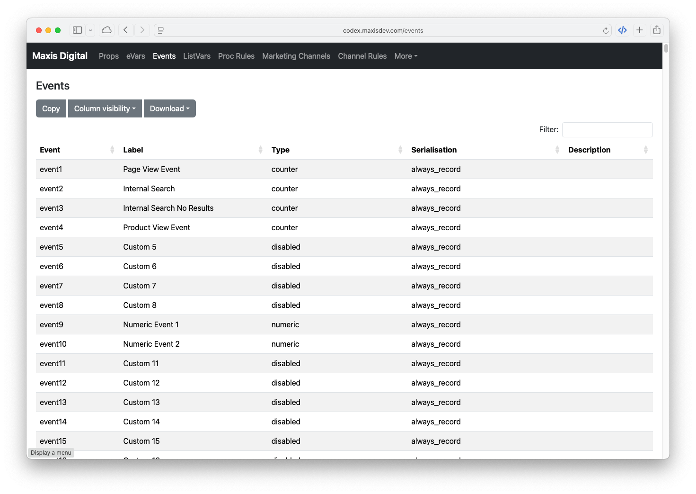

# Codex `v2.0`

### A Data Dictionary for your Adobe Analytics Report Suites

Codex provides **configuration intelligence** for Adobe Analytics, serving as a living data dictionary that documents your report suite implementation. It gives analysts, developers, and stakeholders a single source of truth for understanding how your Adobe Analytics data is structured and collected.

Converted from [RShiny SDR](https://github.com/Brontojoris/rshiny-sdr) to Python/Flask.

---

## Features

- **Report Suite Overview** — Landing page with configuration health stats and cache status
- **Report Suites** — Browse all report suites in the Adobe Analytics company with key configuration stats
- **Conversion Variables (eVars)** — View all eVars with allocation, expiration, descriptions, and 30-day trend charts
- **Traffic Variables (Props)** — Browse props with pathing and list support settings, and 30-day trend charts
- **Success Events** — List all events with type, serialisation, descriptions, and 30-day trend charts
- **List Variables** — View ListVar configurations, delimiters, and 30-day trend charts
- **Segments** — Browse all segments defined in the report suite (API 2.0)
- **Calculated Metrics** — View all calculated metrics with formula cross-references and 30-day trend charts (API 2.0)
- **Processing Rules** — Display all processing rules with conditions and actions (API 1.4)
- **Marketing Channels** — Browse channel definitions and settings (API 1.4)
- **Channel Rules** — View marketing channel classification rules (API 1.4)
- **Detail Views** — Drill into individual dimensions, events, segments, and metrics for full configuration details, including related Processing Rules, Marketing Channel Rules, and Adobe Launch rules
- **Dimension Notes** — Annotate any dimension or event with plain-English descriptions, technical context, platform availability, and user-managed tags
- **CSV Export** — Export any configuration table for documentation or audits
- **Background Pre-Caching** — Configuration data is pre-warmed at startup and refreshed every 24 hours
- **Cache Management** — View cache status for all data sources; force-refresh individual caches on demand
- **API Debug** — Interactive browser-based explorer for all Adobe Analytics API 1.4 and 2.0 endpoints; browse, inspect parameters, and send read-only requests proxied securely through the server
- **Adobe Launch Integration** — See which Launch (Tags) rules reference each variable, with Action/Condition/Event badges and match-quality indicators to distinguish genuine variable assignments from name-only matches

---

## Quick Start

For a detailed step-by-step walkthrough, see [docs/quick-start.md](docs/quick-start.md) (local) and [docs/quick-start-docker.md](docs/quick-start-docker.md) (Docker).

### Prerequisites

- Python 3.13+
- [uv](https://docs.astral.sh/uv/) package manager
- Adobe Analytics API credentials (see [Configuration](#configuration))

### Installation

```bash
# Clone the repository
git clone https://github.com/maxisdigital/codex.git
cd codex

# Install dependencies
uv sync

# Create a secrets directory and copy the config template
mkdir -p ~/secrets/codex
cp config.dist.json ~/secrets/codex/acme.json
# Edit ~/secrets/codex/acme.json with your credentials

# Point Codex to the secrets directory
export CODEX_SECRETS_DIR=~/secrets/codex
```

### Running the Application

```bash
# Start the Flask development server
uv run run.py

# Default: http://127.0.0.1:5010
# Custom port: PORT=5011 uv run run.py
```

The app is available at `http://127.0.0.1:5010`. The root `/` shows the brochure site; your client dashboard is at `http://127.0.0.1:5010/<client>/` (where `<client>` is the filename stem of your config, e.g. `acme`).

### Health Check

```bash
# Verify setup (checks config, directories, imports)
uv run verify_setup.py
```

---

## Configuration

Codex uses a **secrets directory** model: credentials are stored in per-client JSON files rather than a single `config.json`. This allows a single Codex instance to serve multiple clients.

### Secrets Directory

Set the `CODEX_SECRETS_DIR` environment variable to a directory containing one JSON file per client:

```
~/secrets/codex/
├── acme.json        → accessible at /acme/
└── another-co.json  → accessible at /another-co/
```

Use `config.dist.json` as the template for each file. Files starting with `_` are reserved and ignored.

### Required Settings

| Key | Description |
|-----|-------------|
| `APP_TITLE` | Name displayed in the header (e.g., "Acme Corp") |
| `AW_REPORTSUITE_ID` | Your Adobe Analytics report suite ID |
| `API_VERSION` | Set to `"2.0"` |

### API 2.0 (OAuth2) — Recommended

| Key | Description |
|-----|-------------|
| `CLIENT_ID` | OAuth2 Client ID from Adobe I/O Console |
| `CLIENT_SECRET` | OAuth2 Client Secret |
| `ORGANIZATION_ID` | Your Adobe Org ID (e.g., `ABC123@AdobeOrg`) |
| `SCOPES` | OAuth2 scopes (optional, has sensible defaults) |

### API 1.4 (WSSE) — Legacy

| Key | Description |
|-----|-------------|
| `AW_USERNAME` | WSSE username (format: `username:company`) |
| `AW_SECRET` | WSSE shared secret |

> **Note:** Even when using API 2.0, WSSE credentials are still required for certain endpoints not yet migrated to 2.0 (e.g., Processing Rules, Marketing Channels).

### Example Client Config (`~/secrets/codex/acme.json`)

```json
{
    "APP_TITLE": "Acme Corp",
    "AW_REPORTSUITE_ID": "acmeprod",
    "API_VERSION": "2.0",
    "CLIENT_ID": "your-client-id",
    "CLIENT_SECRET": "your-client-secret",
    "ORGANIZATION_ID": "ABC123@AdobeOrg",
    "SCOPES": "openid, AdobeID, additional_info.projectedProductContext",
    "AW_USERNAME": "user:acme",
    "AW_SECRET": "wsse-secret",
    "API_V14_TIMEOUT": 5,
    "LAUNCH_ENABLED": false,
    "LAUNCH_PROPERTY_ID": "",
    "LAUNCHPAD_URL": ""
}
```

> **Note:** `LAUNCH_ENABLED`, `LAUNCH_PROPERTY_ID`, and `LAUNCHPAD_URL` are optional. Enable to surface Adobe Launch rules on dimension detail pages.

---

## Authentication

Codex uses a **hybrid API approach**:

- **API 2.0 (OAuth2)** — Primary method for most endpoints (eVars, Props, Events, ListVars, Segments, Calculated Metrics). OAuth2 credentials are obtained from the [Adobe I/O Console](https://console.adobe.io/).

- **API 1.4 (WSSE)** — Legacy method required for endpoints not yet available in API 2.0 (Processing Rules, Marketing Channels, Channel Rules). WSSE credentials can be obtained from Admin → User Management → Users in Adobe Analytics.

> **Note:** Adobe has announced the deprecation of API 1.4. Codex automatically retries on alternative API domains (`api2`, `api3`, `api4.omniture.com`) if the primary endpoint is unresponsive.

---

## Docker

See [docs/quick-start-docker.md](docs/quick-start-docker.md) for the full Docker setup guide.

```bash
# Create a secrets directory next to docker-compose.yml
mkdir -p secrets
cp config.dist.json secrets/acme.json
# Edit secrets/acme.json with your credentials

# Build and run
docker compose up -d --build

# View logs
docker compose logs -f
```

The app listens on port `5010`. The `docker-compose.yml` mounts `./secrets` as a read-only volume and sets `CODEX_SECRETS_DIR` automatically.

---

## Project Structure

```
codex/
├── app/
│   ├── routes/          # Flask route handlers
│   │   ├── main.py      # All client routes (prefixed /<client>/)
│   │   └── auth.py      # Auth routes (login, callback, logout)
│   ├── services/        # API wrappers and business logic
│   │   ├── adobe_analytics_v2.py   # API 2.0 client (OAuth2)
│   │   ├── adobe_analytics.py      # API 1.4 client (WSSE)
│   │   ├── adobe_auth.py           # OAuth2 token management
│   │   ├── adobe_launch.py         # Adobe Reactor (Tags) API client
│   │   ├── cache.py                # JSON file-based caching
│   │   ├── cache_warmer.py         # Background cache pre-warming (APScheduler)
│   │   ├── config_loader.py        # Multi-client config loader (CODEX_SECRETS_DIR)
│   │   ├── git_info.py             # Git branch/commit info for footer
│   │   └── notes.py                # Dimension annotation storage
│   ├── static/
│   │   └── brochure/    # Brochure site assets (CSS, JS, images)
│   └── templates/       # Jinja2 HTML templates
├── assets/              # Project assets (Swagger specs, screenshots)
│   └── swagger/         # Adobe Analytics API 1.4 and 2.0 Swagger specs
├── cache/               # Cached API responses (git-ignored)
├── exports/             # CSV exports directory
├── notebooks/           # Jupyter notebooks for API exploration
├── docs/                # Documentation and post-mortems
└── config.dist.json     # Config template (copy to $CODEX_SECRETS_DIR/<client>.json)
```

### URL Structure

All client routes are prefixed with `/<client>/` where `<client>` is the filename stem of the config JSON:

| URL | Content |
|-----|---------|
| `/` | Brochure site |
| `/<client>/` | Client overview dashboard |
| `/<client>/evars` | eVar listing |
| `/<client>/props` | Prop listing |
| `/<client>/events` | Event listing |
| `/<client>/...` | All other Codex routes |

---

## Live Demo

[https://codex.maxisdev.com](https://codex.maxisdev.com)



---

## Tools

- **IDE:** [PyCharm 2025.3](https://www.jetbrains.com/pycharm/)
- **Python:** 3.13+
- **Package Manager:** [uv](https://docs.astral.sh/uv/)

---

## Roadmap

See [docs/version-2-roadmap.md](docs/version-2-roadmap.md) for the full v2 plan with complexity assessments and implementation details.

### Completed in v2.0

* [x] Report Suite Overview page
* [x] Background pre-caching (24-hour refresh, force-refresh button)
* [x] Processing Rules cross-linking on dimension detail pages
* [x] Segments listing and detail pages (API 2.0)
* [x] Calculated Metrics listing and detail pages (API 2.0)
* [x] Dimension Notes / annotations
* [x] API Debug page — interactive explorer for all 1.4 and 2.0 endpoints
* [x] Marketing Channel Rules cross-linking on dimension detail pages
* [x] Adobe Launch (Tags) integration — show which Launch rules set each variable
* [x] Cache Management page — view cache status and force-refresh
* [x] Multisite routing — single deployment serves multiple clients via `/<client>/` URL prefix
* [x] Brochure site — product landing page served at `/`

### Planned

* [ ] User OAuth login — per-user Adobe IMS login (config scaffolding in place; full implementation planned)

---

## Known Issues

No known issues at this time. See [docs/todo.md](docs/todo.md) for the full history of bugs and fixes.

---

## Version History

### v2.0 (March – April 2026)

Major feature release built on top of the original Flask conversion. All new features use the Adobe Analytics API 2.0 (OAuth2) or Adobe Reactor API where applicable.

| Feature | Description |
|---------|-------------|
| Report Suite Overview | Landing page with configuration health stats and cache status |
| Segments | Listing and detail pages via API 2.0; human-readable container breakdown |
| Calculated Metrics | Listing, detail pages, formula cross-references, and 30-day trend charts |
| Processing Rules cross-linking | Detail pages show which rules reference each dimension |
| Marketing Channel Rules cross-linking | Detail pages show which channel rules reference each dimension |
| Adobe Launch integration | Detail pages show which Launch (Tags) rules set each variable |
| Background Pre-Caching | Configuration data pre-warmed at startup and refreshed every 24 hours |
| Cache Management | View per-key cache status and force-refresh on demand |
| API Debug | Interactive browser-based explorer for all API 1.4 and 2.0 endpoints |
| Reactor Debug | Interactive explorer for Adobe Launch Reactor API endpoints |
| Dimension Notes | Per-dimension plain-English annotations persisted to disk |
| Data Feed column names | Each dimension detail page shows the corresponding data feed column |
| User-managed Tags | Rename, add, and remove tag options in the Notes panel at runtime |
| Listing page improvements | Sticky headers, lighter alternating rows, toolbar consolidation |
| Detail page panel layout | Processing Rules, Channel Rules, and Launch panels moved to right column |
| Accurate dimension trend charts | Trend charts scoped to dimension-specific hits; eVars use `evar<n>instances`, props use a `metricFilters` segment, events use an `event-exists` segment |
| Launch match type badges | Action / Condition / Event badges parsed from `delegate_descriptor_id`; "Name match" badge flags rule-name-only matches as potential false positives |
| Multisite routing | Single deployment serves multiple clients via `/<client>/` URL prefix; per-client credential files in `CODEX_SECRETS_DIR` |
| Brochure site | Product landing page served at `/`; all client apps continue at `/<client>/` |
| User OAuth login (partial) | Config scaffolding in place; per-user Adobe IMS login planned for a future release |

### v1.0 (December 2025)

Initial conversion of the [RShiny SDR](https://github.com/Brontojoris/rshiny-sdr) application to Python/Flask with Docker support.

| Feature | Description |
|---------|-------------|
| eVars listing and detail | Allocation, expiration, and description for all conversion variables |
| Props listing and detail | Pathing, list support settings for all traffic variables |
| Events listing and detail | Type, serialisation, and descriptions for all success events |
| ListVars listing and detail | ListVar configuration and top-10 value data |
| Processing Rules | Display all processing rules with conditions and actions |
| Marketing Channels | Channel definitions and channel classification rules |
| Core Dimensions | Out-of-the-box Adobe Analytics dimensions |
| CSV Export | Export any configuration table |
| File-based caching | JSON cache with configurable TTL to reduce API calls |

---

## License

MIT

---

*Last updated: 2026-04-15*
