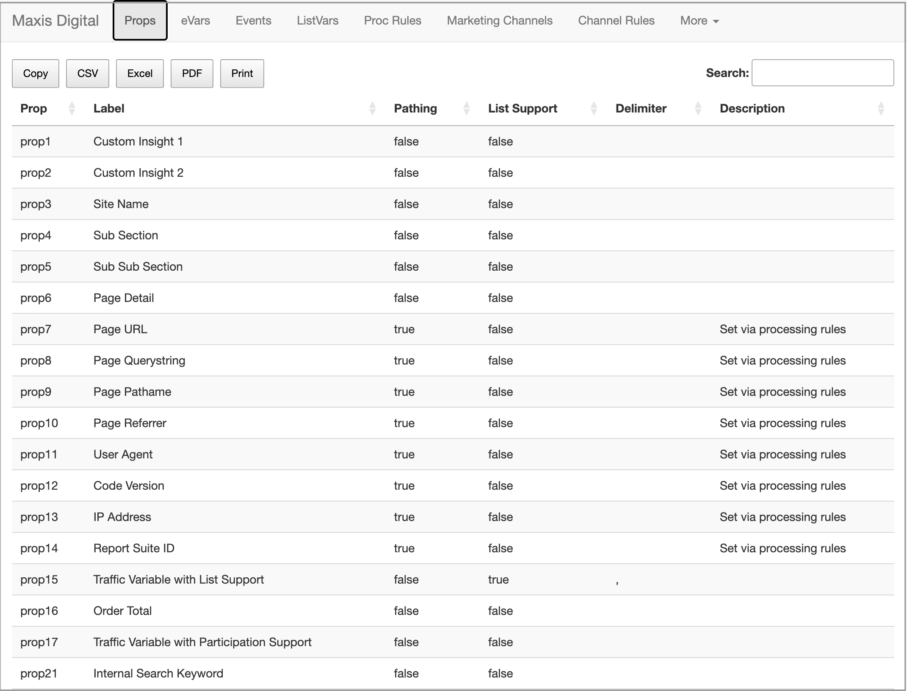

# Codex

### Configuration intelligence for your Adobe Analytics report suites

* Display configuration of eVars, Traffic Variables (props), Success Events
* Surface Processing Rules, Marketing Channel Rules, and key settings
* Health checks for events and critical implementation components
* Top values for eVars/props to validate naming, cardinality, and usage
* Quick configuration snapshots for documentation and audits

Converted from [RShiny SDR](https://github.com/Brontojoris/rshiny-sdr) to Python Flask

## Authentication

This Shiny app relies on [RSiteCatalyst for authentication](https://marketing.adobe.com/developer/documentation/authentication-1/using-web-service-credentials-2) with Adobe's Analytics API.

> Legacy (WSSE) The ‘legacy’ method of authenticating with the Adobe Analytics API requires knowing your User Name and Shared Secret, which can be obtained from the same User Management -> Users -> Access menu in the Admin panel where Web Services Access is granted.

# Configuration

config.json contains the following settings

* **APP_TITLE** Name to put in the top left corner. eg, Company Name
* **AW_REPORTSUITE_ID** The report suite id
* **AW_USERNAME** Your WSSE username
* **AW_SECRET** Your WSSE secret

## [Live Demo](https://jorisdebeer.shinyapps.io/rshiny-sdr/)

## Project Structure

- [Notebooks](./notebooks/): Contains Jupyter notebooks for connecting to and working with the Reactor APIs. Each notebook is designed to be self-contained, providing insights into specific aspects of Launchpad.
- [Docs](docs/main.md): Documentation files for the project.
- [Assets](./assets/): Contains images and other assets used in the documentation.
- [Instructions](./llm_instructions/): Instructions for setting up and using the project.
- [App](./app/): Contains the main application code for Launchpad.
- [Exports](./exports/): Directory where files exported from the App are stored. **If running in Docker, make sure this directory is mounted with read-write permissions (`:rw`) in your `docker-compose.yml`.**

## Tools
- IDE: [PyCharm 2025.2.4](https://www.jetbrains.com/pycharm/)
- Python: 3.13+
- [Launchpy](https://pypi.org/project/launchpy/)

## Roadmap

* Migrate to Adobe Analytics API 2.0