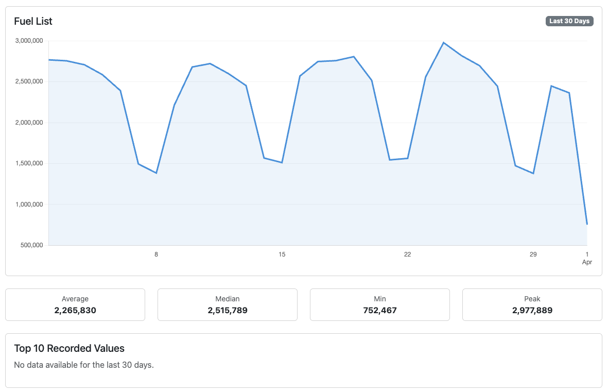

# TODOs and Bugs

This document is a list of smaller todo items and bugs found while using the Codex app.

## TODOs

- [x] In the Components panel on prop/evar/event/listvar detail pages, use the pill style already being used on the Segment/Metric details page instead of the plain hyperlink. **Already done — `components_section` macro uses `badge bg-light text-dark border` pills, matching segment/metric detail pages. Implemented as part of [autopsy 028](autopsies/028-components-panel.md).**
- [x] Hyperlink the segmentId and metricId shown on their respective detail pages the Adobe Analytics equivalent.
  For example,
  * segmentId `s200001582_5df07b97e0a67a0e926c94e1` would link to https://experience.adobe.com/#/@originenergy/so:origin0/analytics/spa/#/components/segments/edit/s200001582_5df07b97e0a67a0e926c94e1
  * metricId `cm200001582_69c1d1263db7d8215a55df17` would link to https://experience.adobe.com/#/@originenergy/so:origin0/analytics/spa/#/components/calculatedMetrics/edit/cm200001582_69c1d1263db7d8215a55df17
  **Fixed in [feature/segment-metric-experience-cloud-links](autopsies/042-segment-metric-experience-cloud-links.md)**
- [x] Hyperlink the Adobe Launch rule into Adobe Tags website. **Fixed in [feature/launch-adobe-tags-deeplinks](autopsies/043-launch-adobe-tags-deeplinks.md)**
- [ ] Consolidate this **todo.md** file into the version-2-roadmap.md file.
- [ ] Add a "Known Issues" section to the README that links to this list of bugs, so users are aware of any current limitations or issues with the app.
- [ ] Add a "Version History" section to the README that lists the major changes and updates for each version of the app.
- [x] Move the following panels on the prop/evar/events/listvar detail pages from the left hand column to the right hand columns below the Top 10 Values table. **Fixed in [feature/detail-page-panel-layout](autopsies/044-detail-page-panel-layout.md)**
  1. Components → renamed to "Segments & Calculated Metrics"
  2. Related Processing Rules
  3. Related Channel Rules → renamed to "Related Marketing Channel Rules"
  4. Adobe Launch
- [x] Allow users to manage (crud) the tags in Journey Squad Owner, and rename to "Tags" **Fixed in [feature/tags-crud](autopsies/047-tags-crud.md)**
- [x] Improve listing pages **Fixed in [feature/listing-page-improvements](autopsies/044-listing-page-improvements.md)**
  - [x] Make the shaded rows on the listing pages lighter by half.
  - [x] Make the table header sticky
  - [x] Put the Copy/Column visibility/Download buttons on the same row as the Refresh button to make better use of the vertical space

## Bugs

- [x] The Data Feed Column for a classified value should just show the parent data dimension. For example `http://127.0.0.1:5010/evars/evar8.suburb` should show `evar8` as the column name, instead of `evar8.suburb`.
- [x] We block the API debug page from sending an POST requests, but some (or all, who really knows) can't actually change any data. That's just how you make a read only call to those endpoints. How do we safely allow those, while still ensuring that no one can ever update data in a report suite? **Fixed in [fix/api-debug-allow-readonly-post](autopsies/046-api-debug-readonly-post.md)**
- [x] When a prop/evar/event/listvar doesn't have any recent data, the trendline chart still shows peaks and valleys. What is this data? If there is none, it should be showing a flatline. Is it cached? Made up? Data from another eVar, or data from a different config.json / Client, but the app is reading cached json files. Either way, the trendline should be accurate. See screenshot for prop15 Fuel List taken from Origin Energy config.  **Fixed in [fix/trendline-data-accuracy](autopsies/048-trendline-data-accuracy.md)**
 
  ## Suggested Improvements

  ### Quick wins

- [ ] ~~**Item 1. Prop and eVar 30-day trend charts**~~

  get_dimension_trend() already exists in the API service and is fully wired for trend reporting, but it's never called from any route — Props and eVars have no trend chart on their detail pages. 

  Events and Calculated Metrics both have them. Adding this is a template + route change only, reusing the existing trend_chart_js macro and Chart.js pattern. Estimated effort: ~1–2 hours.

- [x] **Item 2. Data Feed column name on dimension detail pages**

  The todo asks for the data feed column name (e.g. post_evar5, post_prop3) to appear in the dimension's config table. This data never changes and requires no API call — it's a deterministic mapping from the variable ID.

  A small dict or simple string format (post_evar{N} / post_prop{N} / post_event_list) is all that's needed. Very low risk.

- [x] **Item 3. Processing Rules condition/action formatting**

  The Processing Rules listing shows conditions and actions as compact strings (e.g. if user_server equals any of (...) ... overwrite value of ...). 

  The Processing Rule Examples.csv in docs/ shows the expected structure: a Rule, Section, Conditions, Match Type, Actions pattern. 

  A small formatter that adds newlines before each if/else clause and indents actions under their conditions would make the pseudo-code much more readable. Could be done in Jinja2 or a Python helper.

  ---

  ### Medium effort

 - [x] **Item 4. Marketing Channel Rules cross-linking (Roadmap v2-002)**

  On each Prop/eVar/Event/ListVar detail page, show which Marketing Channel rules reference that dimension — the exact same pattern as the existing Related Processing Rules section. The channel rules data is already cached.

 - [ ] DESCOPED ~~**Item 5. ListVar 30-day trend chart**~~

  Same as suggestion #1 but for ListVar detail pages. get_dimension_trend() accepts any variable ID, so variables/listvar1 works. The listvar_detail.html template just needs the same right-column chart pattern as event_detail.html.

 - [x] **Item 6. Segment detail: human-readable container breakdown**                                                
     The Segment Detail page currently just shows raw JSON for the definition. The same recursive walker used for Calculated Metrics (which produces a "Referenced Metrics / Segments" list) could be adapted for segments — parsing
     container logic into an indented summary showing hit/visit/visitor containers, rules (dimension / operator / value), and nesting. Higher value for complex multi-container segments.

### Larger features

 - [x] **Item 7. Adobe Launch integration (Roadmap v2-003)**
     Show which Adobe Launch (Tags) rules set each variable on the detail pages. Requires a new API client for the Reactor API and new OAuth scopes. High effort but high value — Launch is where most variables are actually set.

- [ ] **Item 8. User OAuth login (Roadmap v2-004)**

    Replace the server-to-server credential with per-user Adobe IMS login. Enables proper access control and makes Codex deployable for a broader audience. The largest architectural change on the roadmap.

## Dones

Occasionally move actions marked off to the "Dones" section. 
Use git history/blame to track when an item was marked as done.

### Todos Done

Last updated 2026-04-01

- [x] Add the allocation and expiration data to the data dimensions listing page. The data is visible on the details page, but not the listing pages
- [x] Change the data dimensions listing page template name. Renamed `table.html` → `listing.html` ([autopsy 019](.docs/autopsies/019-rename-table-template.md))
- [x] Add a Segments listing page (API 2.0 `/segments` endpoint). See [autopsy 025](.docs/autopsies/025-segments-listing.md).
- [x] Add a Calculated Metrics listing and detail page (API 2.0 `/calculatedmetrics` endpoint). See [autopsy 027](.docs/autopsies/027-calculated-metrics.md).
- [x] Create a debug page where I can interact with all of the API 1.4 and API 2.0 endpoints described in:
  - [adobe_analytics_api_1.4_swagger.json](adobe_analytics_api_1.4_swagger.json)
  - [adobe_analytics_api_2.0_swagger.json](adobe_analytics_api_2.0_swagger.json)
- [x] Update the "Report Suites" page and shows all the report suites in the authenticated Adobe Analytics company, and key summary data about each one (e.g., which report suite has the most eVars, or which report suite has the most recent change date). **Fixed in [feature/report-suites-page](.docs/autopsies/031-report-suites-page.md)**
- [x] Cleanup the display of monospace text on the Processing Rules pages. It's a bit smaller than other text, and other pages like Segment Details use a pink monospace font that looks a bit more at home in the app. So maybe use that style instead? **Fixed in [fix/processing-rules-monospace](.docs/autopsies/030-processing-rules-monospace.md)**
- [x] Consolidate the Marketing Channels and Channel Rules into one dropdown to save space on the global navigation. See [autopsy 026](.docs/autopsies/026-channels-nav-dropdown.md).
- [x] Display the Data Feed column name in the data dimensions's details as a new row in the Data Configuration table. Use this page as a reference for the column names: https://experienceleague.adobe.com/docs/analytics/components/reference/data-feeds/columns.html?lang=en This data is quite stable, never changes, so no extra API calls or fancy data mapping are needed.
- [x] The pseduo-code for the "Processing Rules" page is a bit hard to read. But it is sort of structured. There are some IF and ELSE like statements. It would be good to reformat it for the user so it's easier to interpret; add some newlines, and indentations. The [Processing Rule Examples.csv](Processing%20Rule%20Examples.csv) and [Processing Rule Examples.xlsx](Processing%20Rule%20Examples.xlsx) file are a good reference for the structure.
- [x] Update the README and make sure it is up to date with the latest changes.
- [x] Add a panel to the props/evars/events/listvar details pages (similar to the Related Processing Rules) named "Components", and lists Segments and Calculated Metrics that use that data dimension. The user should be able to click on the component name to view the details page for that component. See [autopsy 028](.docs/autopsies/028-components-panel.md).
- [x] In preparation for working on **Item 7. Adobe Launch integration (Roadmap v2-003)** and **Item 8. User OAuth login (Roadmap v2-004)**, we should do a review and cleanup of the app's code and assess if the architecture is correct. If there are simple changes or refactoring that can be made, we should do them.
- [x] Work on all of the recommendations in [035 — Pre-Launch Architecture Review](docs/autopsies/035-pre-launch-architecture-review.md).
- [x] The new API Debug page has a dependency on the swagger files in the docs folder. Initially the Dockerfile didn't include the docs folder, but this has since been fixed. But it raises an important point that assets such as the swagger files should be moved to a more appropriate location, perhaps a new `assets/` folder in the root of the project, to avoid confusion and ensure they are included in the Docker image. **Fixed: moved to `assets/swagger/`; Dockerfile updated to `COPY assets/ assets/`.**
- [x] Add another Debug page for the Adobe Launch Reactor APIs. See [autopsy 039](docs/autopsies/039-reactor-debug-page.md).

### Bugs Done

Last updated 2026-04-1

- [x] Merchandising eVar expiration data shown on the details page is not correct. A MerchVar with purchase event set as expiration, will actually display 1 Days for the expiration value. Checked with eVar39 in Coles Global Prod report suite. **Fixed in PR #26 ([autopsies 016 & 017](.docs/autopsies/016-evar-allocation-expiration-fix.md), [017-merchandising-evar-expiration-bug.md](.docs/autopsies/017-merchandising-evar-expiration-bug.md))**
- [x] Adobe is deprecating the 1.4 version of the Analtytics api. It's not supposed to happen until August 2026, but already we am seeing times (usually for a few hours at a time) where the api.omniture.com endpoints become unresponsive, or the dns won't resolve, or the servers don't answer. Need to find a way to:
  1. Try alternative API domains. Alternative API endpoint domains will be on o: api2.omniture.com, api3.omniture.com, api4.omniture.com
  2. Display a fallback error message. Still show the global navigation, footer, body styling, but replace with a user friendly error message advising the API is not responding, and the data is not available, and to try again later.
- [x] The prop and eVar detail pages don't display any calculated metrics; but it does work for events. I think it is because a calc metric will never have the prop or evar at the top level of logic. Those data dimensions will always be nested inside a segment inside of a calculated metric. **Fixed in [fix/components-calc-metrics-transitive](.docs/autopsies/029-components-calc-metrics-transitive.md)**
- [x] Processing Rules section can be hidden from the classified props and evars screens because you can't set a sub-classification using a proc rule. **Fixed in [fix/hide-panels-for-classified-dimensions](.docs/autopsies/041-hide-rule-panels-for-classifications.md) — also applied to Launch and Channel Rules panels.**